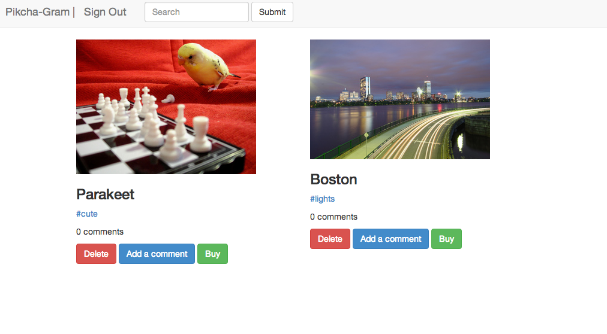

A clone of Instagram with added features, e.g buying the photos.

Users can sign up, upload and sell their photos, which are identified by tags. They can search photos by keywords in the title through the search bar at the top. Images are stored in AWS and uploaded using Paperclip. Stripe is integrated to provide smooth transactions.

### The stack

* Ruby on Rails
* TDD with RSpec & FactoryGirl
* BDD with Capybara
* HTML & CSS with Bootstrap
* Gems: Stripe, Paperclip, Aws-sdk, Devise
* PostgreSQL
* JavaScript and jQuery

### To do

I need to add upvoting and downvoting functionality, using Websockets.
